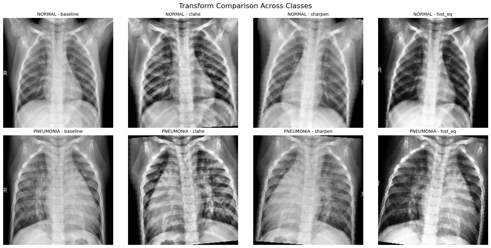

# Pneumonia Detection in Chest X-rays: Image Transformation Study

This repository contains our implementation for analyzing the impact of various image transformation techniques on pneumonia detection accuracy using chest X-ray images.

## Project Overview

We systematically evaluated four different image transformation approaches:
- Baseline (minimal processing)
- Contrast Limited Adaptive Histogram Equalization (CLAHE)
- Image Sharpening
- Histogram Equalization

Our findings demonstrate that image sharpening achieves the highest accuracy (89.6%) and F1 score (91.7%), significantly outperforming the baseline approach.

## Repository Contents

- **Pneumonia_Detection.ipynb**: A Jupyter Notebook exploring pneumonia detection through various image transformation techniques applied to medical imaging data.

## Key Results

| Transformation | Accuracy | Precision | Recall | F1 Score | AUC |
|----------------|----------|-----------|--------|----------|-----|
| Baseline | 0.726 | 0.706 | 0.962 | 0.814 | 0.797 |
| CLAHE | 0.838 | 0.802 | 0.985 | 0.884 | 0.951 |
| Sharpening | 0.896 | 0.911 | 0.923 | 0.917 | 0.956 |
| Hist. Equalization | 0.881 | 0.850 | 0.985 | 0.912 | 0.965 |

## Dataset

This study utilized the Chest X-Ray Images (Pneumonia) dataset from Kaggle, comprising 5,863 X-ray images categorized into pneumonia and normal cases. The dataset can be accessed [here](https://www.kaggle.com/datasets/paultimothymooney/chest-xray-pneumonia/data).

